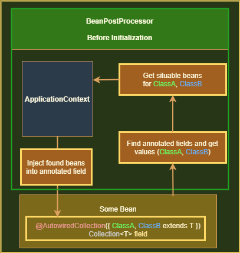

# custom-collection-injection-sample

  This sample is custumized version of spring bean injection for collections. In case of injection into collection spring will put <b>all</b> registered beans with prefered type. '@AutowiredCollection' annotation accepts an array of Classes that suposed to be a spring bean and inject only tham in the same order (without '@Order(n)' annotation).

